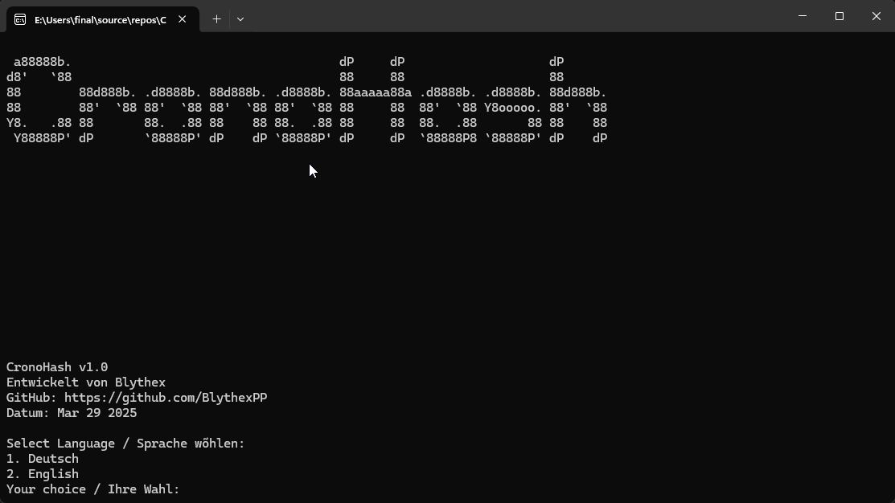

# CronoHash v1.0 🔐

Welcome to **CronoHash v1.0** – an innovative, time-sensitive, and quantum-secure hashing algorithm that redefines the way data is secured. This project combines traditional cryptographic methods with cutting-edge quantum-safe technologies, ensuring your data is protected today and in the future.





---

## Table of Contents
- [Introduction](#introduction)
- [Whitepaper](./WHITEPAPER.md)
- [Features](#features)
- [Architecture](#architecture)
- [Installation](#installation)
- [Usage](#usage)
- [Tests](#tests)
- [License](#license)
- [Contact](#contact)

---

## Introduction

CronoHash v1.0 is designed to produce unique, one-time hashes by binding your data to both time and system-specific characteristics. By integrating dynamic time sources and various system fingerprints, CronoHash ensures that every hash is distinct and non-transferable—making it the ideal solution for secure communication, blockchain identity anchoring, and tamper-proof timestamps.

---

## Whitepaper

For a detailed technical overview, please refer to the [Whitepaper](./WHITEPAPER.md).

---

## Features

- **Spatio-Temporal Binding ⏱️🌐**  
  Combines dynamic time sources (e.g., TSC, Nanotime, Steady Clock) with system fingerprints (e.g., RAM, Cache, CPU ID) to generate unique, environment-bound hashes.

- **Quantum-Secure 🔒**  
  Utilizes SHAKE256 and Kyber512 (via the Open Quantum Safe library) to ensure robust security against both classical and quantum attacks.

- **Flexible Bit Strength 🎛️**  
  Generate hashes in various sizes (128, 256, 512, 1024, 2048 bits) to suit your security needs.

- **Multiple Operating Modes ⚙️**  
  Choose between:
  - **FAST:** High performance with minimal mixing.
  - **BALANCED:** Moderate entropy with balanced performance.
  - **SECURE:** Enhanced security with additional transformation rounds.
  - **ENTROPIC:** Maximum entropy using extra memory walking for further randomness.

- **Standard Ghost Salt Mixing 🧂**  
  A built-in Ghost Salt is applied as a standard step after adaptive time binding and before quantum-safe mixing rounds. This extra mixing boosts entropy and reinforces the uniqueness of the final hash.

---

## Architecture

The project is organized into clear, modular components:

- **Core Algorithm:**  
  - **`CronoHash.cpp` & `crono_hash.h`:**  
    Implements the main hashing functionality and CLI interface. Handles input processing, time binding, and final hash generation.

- **Mathematical Functions:**  
  - **`crono_math.cpp` & `crono_math.h`:**  
    Contains functions for modular arithmetic, endomorphic transformations, and constant-based mixing to enhance entropy.

- **Quantum-Safe Mixing:**  
  - **`crono_quantum.cpp` & `crono_quantum.h`:**  
    Provides additional security layers using SHAKE128 and Kyber512 to incorporate quantum-resistant elements into the hash.

- **System Utilities:**  
  - **`crono_utils.cpp` & `crono_utils.h`:**  
    Offers utility functions for time measurements, generating system fingerprints (RAM, Cache, etc.), and computing adaptive binding factors.

- **Testing Suite:**  
  - **`CronoHashTests.cpp`:**  
    A comprehensive set of unit tests (using Google Test) that validate hash correctness, deterministic behavior, and metadata output.

---

## Installation

### Prerequisites
- **C++17** compatible compiler (Visual Studio, GCC, Clang, etc.)
- **liboqs** (Open Quantum Safe library)
- **CMake** or Visual Studio for building the project

### Build Instructions

1. **Clone the repository:**
   ```bash
   git clone https://github.com/BlythexPP/CronoHash.git
   cd CronoHash
   ```

2. **Build with CMake:**
   ```bash
   mkdir build
   cd build
   cmake ..
   cmake --build .
   ```

   Alternatively, open the solution file (`CronoHash.sln`) in Visual Studio and build the project.

---

## Usage

Run the executable with the following command-line options:

```bash
CronoHash [-i input_string] [-d binding_duration_ms] [-m mode] [-b bit_strength] [-n count]
```

- **-i:** Input string to hash (default: "CronoHash Prime Core v1")
- **-d:** Time binding duration in milliseconds (default: 0 for no binding)
- **-m:** Mode selection (FAST, BALANCED, SECURE, ENTROPIC; default: BALANCED)
- **-b:** Bit strength (allowed values: 128, 256, 512, 1024, 2048; default: 256)
- **-n:** Number of hashes to generate (default: 1)

If no parameters are provided, the program will prompt you for the necessary inputs interactively.


---

## Tests

The project includes a comprehensive suite of unit tests (using Google Test) that ensure:

- Deterministic outputs without time binding.
- Variability in hash outputs when time binding is enabled.
- Correct hash lengths and metadata for various bit strengths and modes.

To run the tests, build the project in test mode and execute the test binary (or run `ctest` in the build directory).

---

## License

This project is licensed under the **MIT License**. See the [LICENSE.txt](LICENSE.txt) file for details.

---

## Contact

Developed by **Blythex**  
GitHub: [https://github.com/BlythexPP](https://github.com/BlythexPP)

Feel free to explore, contribute, and share your feedback. Let’s shape the future of secure token generation together! 🔐🚀
